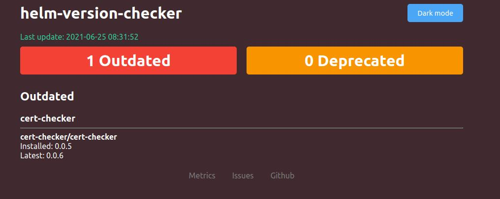
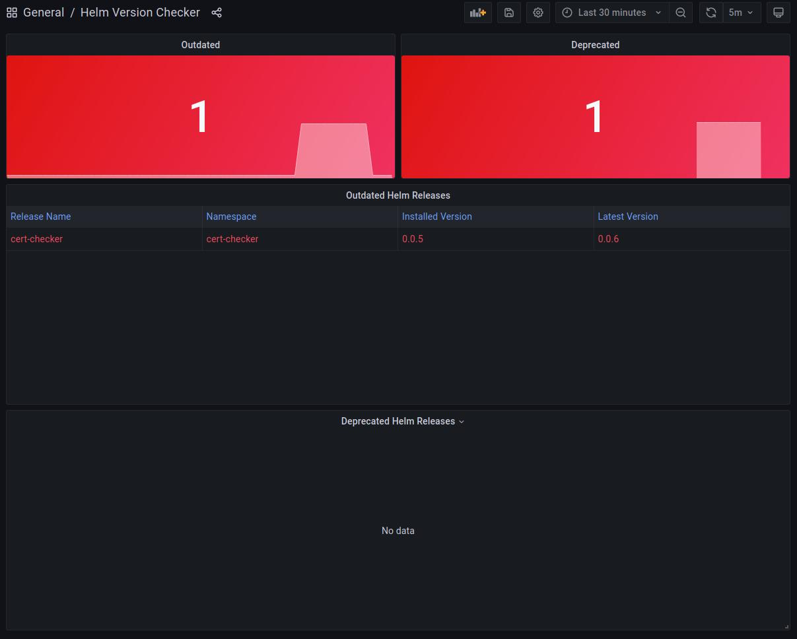

# helm-version-checker

[](https://actions-badge.atrox.dev/mogensen/helm-version-checker/goto?ref=main)
[](https://goreportcard.com/report/github.com/mogensen/helm-version-checker)
[](https://codecov.io/gh/mogensen/helm-version-checker)

Helm version monitoring utility for watching updated and deprecated helm releases and reporting the result as metrics.

This tool is heavily inspired by the awesome tools:

 - [version-checker by jetstack](https://github.com/jetstack/version-checker/).
 - [cert-checker by mogensen](https://github.com/mogensen/cert-checker/).

## Table of contents

- [helm-version-checker](#helm-version-checker)
  * [Table of contents](#table-of-contents)
  * [Features](#features)
    + [Looking for Deprecated Helm Releases](#looking-for-deprecated-helm-releases)
  * [Installation](#installation)
    + [In Kubernetes as static manifests](#in-kubernetes-as-static-manifests)
    + [Helm](#helm)
    + [Kustomize](#kustomize)
  * [Web dashboard](#web-dashboard)
  * [Metrics](#metrics)
    + [Grafana Dashboard](#grafana-dashboard)
- [Build a docker image, load it into kind and deploy helm-version-checker and promeheus/grafana stuff](#build-a-docker-image--load-it-into-kind-and-deploy-helm-version-checker-and-promeheus-grafana-stuff)

<small><i><a href='http://ecotrust-canada.github.io/markdown-toc/'>Table of contents generated with markdown-toc</a></i></small>

## Features

### Looking for Deprecated Helm Releases


---

## Installation

helm-version-checker can be installed as a standalone static binary from the release page

[latest release](https://github.com/mogensen/helm-version-checker/releases/latest/)

```bash
./helm-version-checker

...
# Now open browser at:
#   -  http://localhost:8081/
#   -  http://localhost:8080/metrics
```

### In Kubernetes as static manifests

helm-version-checker can be installed as static manifests:

```sh
$ kubectl create namespace helm-version-checker

# Deploy helm-version-checker, with kubernetes services and demo configuration
$ kubectl apply -n helm-version-checker -f deploy/yaml/deploy.yaml

# If you are using the Grafana sidecar for loading dashboards
$ kubectl apply -n helm-version-checker -f deploy/yaml/grafana-dashboard-cm.yaml

# If you are using the Prometheus CRDs for setting up scrape targets
$ kubectl apply -n helm-version-checker -f deploy/yaml/servicemonitor.yaml
```


### Helm

helm-version-checker can be installed as as helm release:

```bash
$ kubectl create namespace helm-version-checker
$ helm install helm-version-checker deploy/charts/helm-version-checker --namespace helm-version-checker
```

Depending on your setup, you may need to modify the `ServiceMonitor` to get Prometheus to scrape it in a particular namespace.
See [this](https://github.com/prometheus-community/helm-charts/tree/main/charts/kube-prometheus-stack#prometheusioscrape).

You may also need to add additional labels to the `ServiceMonitor`.
If you have installed the `prometheus-community/kube-prometheus-stack` with the name of `prometheus` the following should work:

```bash
$ helm upgrade helm-version-checker deploy/charts/helm-version-checker \
    --namespace helm-version-checker    \
    --set=grafanaDashboard.enabled=true \
    --set=serviceMonitor.enabled=true   \
    --set=serviceMonitor.additionalLabels.release=prometheus
```

### Kustomize

helm-version-checker can be installed using [kustomize](https://kustomize.io/):

Create a `kustomization.yaml` file:
```yaml
apiVersion: kustomize.config.k8s.io/v1beta1
kind: Kustomization
namespace: helm-version-checker
resources:
- github.com/mogensen/helm-version-checker/deploy/yaml
# optionally pin to a specific git tag
# - github.com/mogensen/helm-version-checker/deploy/yaml?ref=helm-version-checker-0.0.1

```
Use the `kustomization.yaml` file to preview and deploy helm-version-checker:
```bash
$ kustomize build kustomization.yaml | less # preview yaml manifests
$ kustomize build kustomization.yaml | kubectl apply --dry-run=client -f - # dry-run apply manifests
$ kustomize build kustomization.yaml | kubectl apply -f - # deploy manifests
```

## Web dashboard

By default, helm-version-checker will expose a web ui on `http://0.0.0.0:8081/`.


<center></center>
<p align="center">
  <b>Web dashboard</b><br>
</p>

## Metrics

By default, helm-version-checker will expose the version information as Prometheus
metrics on `http://0.0.0.0:8080/metrics`.

### Grafana Dashboard

A Grafana dashboard is also included in this repository.
It is located in the deployment folder: `deploy/yaml/grafana-dashboard-cm.yaml`


<center></center>
<p align="center">
  <b>Grafana Dashboard</b><br>
</p>

# Local development

Build a docker image, load it into kind and deploy helm-version-checker and promeheus/grafana stuff:

```bash
make dev-kind-create
make image dev-kind-install
```

Access the local infrastructure here:

| System             | URL                                                                                                        |
| ------------------ |------------------------------------------------------------------------------------------------------------|
| Prometheus:        | http://prometheus.localtest.me/graph?g0.expr=helm_version_checker_is_latest%7B%7D&g0.tab=1&g0.stacked=0&g0.range_input=1h&g1.expr=helm_version_checker_is_deprecated%7B%7D&g1.tab=1&g1.stacked=0&g1.range_input=1h |
| Grafana:           | http://grafana.localtest.me/d/helm-version-checker/helm-version-checker                                    |
| Dashboard:         | http://helm-version-checker.localtest.me/                                                                  |
